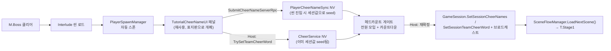

# Tutorial Design

정식 **Tutorial** 씬 설계 문서 (구 Lobby 흡수 — 사전 게이트 구간 + 조작 연습 + CheerName/TeamCheerWord 설정) + **Interlude** 씬 설계 문서 (M.Boss → T.Stage1 사이, CheerName/TeamCheerWord 2차 변경 기회, §3.4).

> **2026-09 문서 분리.** 응원(Cheer) 시스템의 규칙·네트워크·UI 상세는 **[`CheerSystemDesign.md`](CheerSystemDesign.md)**로 이동했다. 이 문서는 **Tutorial/Interlude 씬의 콘텐츠·구역 배치·게이트 흐름**만 다룬다 — 응원 버프 규칙은 이 문서에서 다루지 않음.

> **2026-09-06 확정 [Ship Must]:** CheerName/TeamCheerWord는 한 판에 **정확히 2번** 바꿀 수 있다 — ①**Tutorial** (게임 시작 전), ②**Interlude** (M.Boss 클리어 후, T.Stage1 진입 전, "쉬어가는" 인터미션 씬). 그 외 모든 M/T 스테이지에는 변경 UI 자체가 없다 — 별도 잠금 플래그가 아니라 **"UI가 존재하는 씬이 두 곳뿐"이라는 사실 자체가 2회 제한을 강제**한다(§3.4).

관련: [`NetworkDesign.md`](NetworkDesign.md) §6B (네트워크·수명주기 관점 SSOT — 이탈 정책, Kick 폐지, Invite HUD, 게이트 동작. 이 문서는 콘텐츠 관점만).

**범례**

| 태그 | 의미 |
|------|------|
| **[Ship Must]** | **2026-09-01 정식 출시** 전 필수 |
| **[Post-Launch]** | 정식 이후 |

---

## 0. 정식 출시 — 범위 요약 (Tutorial 관점)

| 항목 | **[Ship Must]** |
|------|-----------------|
| 씬 흐름 | Title → **Tutorial** → M1…5→M.Boss → **Interlude** → T1…5→T.Boss → End.Demo (`1.Lobby` 폐지, 2026-08-17. `Interlude` 신규, §1.1) |
| Tutorial 씬 | **필수 경로** (연습 구간은 경험자 생략 가능). **구 Lobby 역할(색 배정·Invite·Start) 흡수** — §2 |
| Interlude 씬 | **필수 경로** (생략 불가) — M.Boss 클리어 후 T.Stage1 진입 전, CheerName/TeamCheerWord **2차 변경** 기회 1회 — §1.1, §3.4 |
| CheerName/TeamCheerWord | **딱 2번**: Tutorial(1차) + Interlude(2차)에서만 설정 가능 — 개인 CheerName은 각자, TeamCheerWord는 Host. 규칙 상세는 `CheerSystemDesign.md` §3, 2차 변경 절차는 §3.4 |
| **말해보기** | Tutorial에서 확정↔재변경 반복 가능. 상세는 `CheerSystemDesign.md` §5 |
| 인게임 설명 | Tutorial(핵심 메카) + `DialogueUI`(M/T 구역별) |
| **멀티 연결** | Steam P2P + Lobby(`NetworkDesign.md` ④) |
| **목표** | 2026-09-01 원격 협동 + 보이스 + 응원 + Tutorial |
| **개발자 테스트** | PC 2대 → Steam 2인 Must; 4인 1회 권장 |

> **데모/Playtest 없음.** 원격 IP Join/UDP discovery 미사용. 개발=ParrelSync·localhost, 배포=Steam(`ReleaseRoadmap.md` §3).

응원 버프 규칙(개인/팀 버프, CheerName/TeamCheerWord 검증 규칙, Vosk 인식, 네트워크 RPC, 버프 UI)은 전부 **`CheerSystemDesign.md`** SSOT.

---

## 1. 씬 흐름

```
Title → Tutorial → M.Stage1…5 → M.Boss → Interlude → T.Stage1…5 → T.Boss → End.Demo
```

정식 경로에 Tutorial **포함**. `1.Lobby`는 더 이상 존재하지 않는다 — 접속 즉시 `Tutorial`에 캐릭터가 스폰된다(색 자동배정, `NetworkDesign.md` §6B.2). 연습 콘텐츠(Stealth/응원 등)는 경험자가 생략 가능하지만(§4), **사전 게이트 구간 자체(스폰·게이트 통과)는 누구도 생략 불가**.

`M.Boss`와 `T.Stage1` 사이의 `Interlude`도 마찬가지로 **누구도 생략 불가**(§1.1) — Mouth 구역 풀코스를 끝내고 Esophagus 구역으로 넘어가는 "쉬어가는" 인터미션이자, CheerName/TeamCheerWord 2차 변경의 유일한 기회다.

### 1.1 `Interlude` 씬 — 위치·역할

| 항목 | 내용 |
|------|------|
| 씬 이름 | `Interlude` (Build Settings 등록, `M./T.` 접두사 없음 — 특정 구역 소속이 아니라 그 사이 휴식 지점이라는 의미) |
| 위치 | `SceneFlowManager.sceneSequence`에서 `M.Boss` 바로 뒤, `T.Stage1` 바로 앞 |
| 역할 | ①CheerName/TeamCheerWord **2차 변경**(§3.4) + ②전원 모임 게이트 통과 후 `T.Stage1` 진입 |
| 생략 | **불가** — Tutorial의 CheerName/TeamCheerWord 설정 구역과 동일하게 매 판 필수 |
| 콘텐츠 | 전투/퍼즐 없음. Tutorial 구역 2(§2)와 동일한 CheerName/TeamCheerWord 패널 + 전원 헤드카운트 게이트만 |
| BGM/SFX | `M./T.` 접두사가 아니므로 `SceneFlowManager.PlayStageTransitionSfx`(구역 진입 SFX)·`BGMManager` 구역 자동 전환이 걸리지 않음 — 필요하면 씬에 별도 BGM 트리거 배치(사용자) |

---

## 2. Tutorial 구역 (4구역)

Tutorial은 **자유 이동 구간**이다 — 아래 구역을 순서 상관없이 자유롭게 오가다, 마지막에 `TutorialGatherZone`에 모이면 `M.Stage1`로 넘어간다.

| # | 구역 | 내용 | 신규 | 경험자 |
|---|------|------|------|--------|
| (사전) | 접속/스폰 | 접속 즉시 스폰 + 색 자동배정(중복없음) + Invite HUD(구 로비 흡수, `NetworkDesign.md` §6B) | 필수 | 필수 (생략 불가) |
| 1 | 스텔스 체험 | 은신 플레이 감 잡기 | 있음 | **생략 가능** |
| 2 | CheerName/TeamCheerWord 설정 | 상호작용 표지판(`TutorialCheerNameSignboard`) → 개인 CheerName 입력·확정·말해보기(자유 반복) + **Host 전용 TeamCheerWord 입력 필드**(신규, §3) | 표지판 상호작용으로 개폐 — `PlayerPrefs` 스킵 없음 | **생략 불가** (매 판 재입력) |
| 3 | 응원 1회 체험 | 자기 CheerName 발화 → 개인 버프 발동 감 잡기 + (인원 2+ 시) TeamCheerWord 다같이 외쳐서 팀 버프 체험 | 있음 — **개편 필요**(구 cross-target 체험 → self+team 체험으로 교체) | **생략 가능** |
| 4 | `TutorialGatherZone` | 전원이 존에 모이면 카운트다운 → `M.Stage1` (§5) | **필수** | **필수** |

> **색 패드 연습(후보로 검토했던 것):** 보류. 필요성이 재확인되면 별도 구역으로 추가 논의.

**구역 2/3 안내 문구 갱신 필요:**
- 구역 2 패널에 "확정 후 팀원에게 이 이름을 외쳐달라 해서 인식되는지 확인해보세요" 안내는 유지.
- **[신규]** "음성 인식이 잘 안 되거나 마이크가 없으면 옵션(Options) → 숫자키로 응원하기를 켜세요" 안내 추가 (`CheerSystemDesign.md` §6.2).
- **[신규]** Host에게만 보이는 TeamCheerWord 입력 섹션에 "팀 전체가 함께 외칠 단어를 정해주세요(기본값: fighting)" 안내.

---

## 3. CheerName / TeamCheerWord 설정 UX (Tutorial 화면)

> 검증 규칙(형식·금칙어·중복·충돌)은 `CheerSystemDesign.md` §3 SSOT. 이 절은 **Tutorial 화면에서 어떻게 입력·확정하는가**만 다룬다.

### 3.1 어디서 설정하나

- **씬:** `Tutorial` 하나. 별도 로비 씬 없음.
- **개인 CheerName:** Tutorial 진입(=접속) 즉시 스폰돼 있는 **Player별로 독립된 이름** — "슬롯" 개념 없음. 각자 자기 화면에서 자기 캐릭터의 이름만 입력.
- **TeamCheerWord [신규]:** 같은 패널에 **Host에게만 보이는** 별도 입력 섹션. 비-Host는 현재 값을 읽기 전용으로 확인만.
- **UI:** `TutorialCheerNameUI`(로컬 입력창). 확정 시 자기 캐릭터 머리 위 이름표(`PlayerNameTagUI`)·팀원 화면에 즉시 반영.
- 채팅 UI로 설정하지 않음. 타이틀에서 설정하지 않음. `PlayerPrefs` 기억 없음 — 매 판 새로 입력.

### 3.2 확정 → 말해보기 → 재변경 (자유 반복)

```
입력 → Enter(확정 제출) → Host 검증 → 통과 시 전원에 즉시 반영 + Vosk grammar 재빌드
  → 말해보기(육안·청각 확인) → 마음에 안 들면 다시 입력 → …(반복)
```

| 항목 | 규칙 |
|------|------|
| 잠금 | **없음.** Ready 같은 상태가 Tutorial엔 없으므로 언제든 재확정 가능 |
| "최종 확정" | 별도 단계 없음 — **`TutorialGatherZone` 통과 시점의 값이 곧 최종값** (§5) |
| 강제 | 말해보기 실패해도 진행 가능. 안내만 |
| 개폐 | 상시 표시 아님 — 구역 2 표지판(`TutorialCheerNameSignboard`) 상호작용으로 게이트 통과 전까지 언제든 열어 재확정 |

### 3.3 소유·색 변경

- CheerName은 색/캐릭터가 아니라 **플레이어(슬롯)**에 붙는다. 색을 바꿔도 커스텀 문자열은 플레이어를 따라간다.
- TeamCheerWord는 플레이어에 붙지 않고 **세션(방) 전체**에 붙는다 — Host가 바뀌어도(없음, 이 프로젝트는 Host 고정) 값 자체는 세션 동안 유지.

### 3.4 Interlude — CheerName/TeamCheerWord 2차 변경 [Ship Must, 코드 완료 · 씬 배치 남음]

> **왜 필요한가:** Tutorial 시점엔 아직 아무 판도 안 해봐서 이름을 신중히 못 고른다. Mouth 구역(M1~M.Boss)을 다 겪고 나면 "이 이름 말하기 불편하네" 같은 실감이 생기므로, Esophagus 구역(T1~) 진입 전에 **딱 한 번 더** 고칠 기회를 준다.

**현재 구조 (SSOT):**

- CheerName의 진짜 SSOT는 `Tutorial` 게이트 통과 시점에 얼려지는 `GameSession` 세션 스냅샷이다. `CheerService.GetCheerName(colorIndex)`가 ①세션 스냅샷 → ②`PlayerCheerNameSync` 실시간 NV → ③색 기본값 순으로 읽고, `CheerKeywordEngine`(Vosk 그래머)도 항상 이 함수를 쓴다 — 그래서 그래머와 응원 판정이 항상 일치한다.
- M/T 스테이지는 **씬마다 Player를 완전히 새로 스폰**한다(`destroyWithScene:true`) — `PlayerCheerNameSync`의 NetworkVariable은 매 씬 진입 시 빈 값으로 리셋된다. 지금까지는 아무도 그 NV를 직접 읽지 않아 문제가 없었다(`GetCheerName`이 세션값을 우선하므로 무시됨).
- CheerName을 바꾸는 UI(`TutorialCheerNameUI` + `TutorialCheerNameSignboard`)는 이미 범용 컴포넌트라 Tutorial 전용 로직이 없다 — **Interlude 씬에 그대로 재배치해서 재사용**한다.
- 게이트 패턴도 이미 존재: `TutorialGatherZone`(색 무관 헤드카운트 트리거, 순수 로컬 센서)을 관리자(Host 레인)가 폴링해서 카운트다운 → 통과 시 확정 로직을 부른다. Interlude에서도 동일 패턴을 복제한다.

#### 3.4.1 복잡도 비교 — Tutorial `CompleteGate()` 7종 중 Interlude가 다시 해야 하는 건 2종뿐

`TutorialNetworkManager.CompleteGate()`가 게이트 통과 시 확정하는 세션 데이터는 7가지지만, 그중 5가지는 **세션 전체에 걸쳐 1회만 정해지면 끝**이라 Interlude에서 다시 손댈 필요가 없다.

| # | Tutorial `CompleteGate()`가 하는 일 | Interlude에서 재확정 필요? | 이유 |
|---|---|---|---|
| 1 | `PlayerSpawnManager.InitializeOnline(colorDict)` | 아니오 | 1회 캐시된 뒤 M1~M.Boss~T.Stage1~T.Boss까지 계속 재사용됨. Interlude도 그 재사용 대상에 낄 뿐 |
| 2 | 랜덤 시드 생성 + 배포 | 아니오 | 세션 전체 공용 시드. 스테이지 퍼즐 재배치용 시드는 사망 리로드 때 별도로 새로 뽑음(§11.2) — 무관 |
| 3 | 세션 시작 서버시각 배포 | 아니오 | 판 전체에 1개, 안 바뀜 |
| 4 | `GameSession.SetActiveColors` | 아니오 | 색 배정은 Tutorial에서 끝, 게임 중 재변경 경로 없음(AGENTS.md 확정 원칙) |
| 5 | **CheerName 세션 스냅샷 확정** | **예** | 이 절의 대상 |
| 6 | **TeamCheerWord 세션 스냅샷 확정** | **예** | 이 절의 대상 |
| 7 | DisplayName/VoiceId 세션 스냅샷 확정 | 아니오 | Steam 닉네임/보이스ID는 판 중에 안 바뀜 |

**결론:** `InterludeNetworkManager`는 `TutorialNetworkManager`(590줄, 스폰·색배정·시드·DisplayName·VoiceId 포함)의 스폰/색배정 로직을 **전부 제외**하고 게이트 카운트다운 + CheerName·TeamCheerWord 재확정 + 다음 씬 전환만 남긴 것 — 대략 100줄 안팎, 난이도 **낮음~중간**. 새로운 개념 없음, 전부 기존 패턴(`TutorialGatherZone` 폴링, `ClientRpc` 브로드캐스트, `SceneFlowManager` 호출)의 재조합.

#### 3.4.2 CheerName 실시간 반영·테스트가 안 되는 문제 → 우선순위 역전 확정

Interlude 진입 시점엔 `GameSession.HasSessionCheerNames`가 **이미 true**(Tutorial에서 얼려짐)라서, `CheerService.GetCheerName`/`GetColorIndex`의 ①세션 스냅샷 우선순위가 항상 이겨버린다. Interlude 패널에서 새 이름을 제출해도(NV는 바뀜) **음성 그래머·응원 판정은 여전히 옛 이름을 본다** — "말해보기" 테스트가 새 이름으로 안 됨.

**TeamCheerWord는 이 문제가 없다.** `CheerService.TeamCheerWord`(get)는 항상 그 씬 실시간 NV를 직접 읽어서, Host가 바꾸면 즉시 반영·테스트 가능.

**확정된 수정 — 우선순위 역전:** `CheerService.GetCheerName(colorIndex)` / `GetColorIndex(name)`을 **①실시간 커스텀 NV(`PlayerCheerNameSync.GetAllCustomCheerNames()`) → ②세션 스냅샷(fallback) → ③색 기본값**으로 뒤집는다.

> **2026-09-06 리뷰 보정 — 왜 `GetAllEffectiveNames()`가 아니라 `GetAllCustomCheerNames()`인가:** `GetAllEffectiveNames()`는 NV가 비면 **색 기본값을 채워서** 돌려준다. 그걸 1순위로 쓰면, 아래 #2(NV 씨딩)가 어떤 이유로든 실패한 플레이어의 빈 NV가 "기본값"이라는 유효한 답으로 위장해 세션 확정값을 가려버린다 — 그래머·응원 판정만 조용히 틀어지는 과거 회귀(`CheerKeywordEngine.ResolveOwnerCheerName` 주석의 전례)가 그대로 재발한다. 그래서 **커스텀 값이 실제로 설정된 NV만** 1순위로 본다. 새 이름 제출은 항상 non-empty이므로 "즉시 테스트" 요구는 그대로 충족되고, 유일한 차이는 Interlude에서 이름을 **빈 값으로 지워 색 기본값으로 되돌리는** 경우 게이트 통과 전까지 옛 이름이 보인다는 것뿐이다(게이트에서 유효 이름 기준으로 확정되므로 최종 결과는 정상).

- Tutorial/Interlude: 방금 입력한 값이 즉시 그래머·판정에 반영 — "즉시 테스트" 요구 충족.
- 나머지 M/T 스테이지: 아래 "필요한 코드 변경" 표 #2(NV 씨딩) 덕분에 NV == 세션값이라 결과가 완전히 동일 — **동작 변화·회귀 없음.**
- NV로 매칭되는 플레이어가 하나도 없을 때(씬 전환 사이 빈틈 등)만 세션 스냅샷으로 폴백 — 안전장치.

**남는 부작용 (사용자 확인 완료, 그대로 수용):** "말해보기 = 실제 응원 제출"(§3.2 기존 설계) 그대로 유지 — Interlude에서 실제로 말해서 테스트하면 그 판의 쿨다운(기본 15초)이 실제로 시작된다. T.Stage1 진입 시 방금 테스트한 사람만 쿨다운이 걸려있는 상태로 시작할 수 있음 — Tutorial과 동일한 기존 설계를 그대로 계승, 별도 억제 로직 추가하지 않음.

#### 3.4.3 Interlude → T.Stage1 전환 안전성 — Tutorial → M.Stage1 버그 재발 여부

`NetworkDesign.md` §11.1: "Tutorial→M.Stage1 전환 시점부터는 §11 배치 스폰 축(①Load→②Spawn→③Owner→④Ready→⑤Play)이 정상 적용된다." Interlude는 이 축 안(M.Boss→Interlude, Interlude→T.Stage1 둘 다 "Host LoadScene" 문 하나를 한 번 더 타는 것)에 있으므로, M1→M2→…→M.Boss 사이에 이미 여러 번 검증된 배치 스폰 패턴과 **완전히 동일**하다.

과거 Tutorial↔M.Stage1 전환에서 겪은 버그(`NetworkDesign.md` §6B.7 P1/P2 버그 1~4)와 대조:

| 과거 버그 | 원인 | Interlude 재현 여부 |
|---|---|---|
| 버그1 — 늦게 합류한 Client가 Ready 신호 못 받음 | Tutorial 특유의 "접속자 한 명씩 순차 합류" 구조 | **재현 안 됨** — Interlude는 이미 확정된 고정 인원을 배치 스폰(`PlayerSpawnManager.SpawnNetworkPlayers`)으로 한 번에 스폰. 중간 합류 자체가 없음(no reconnect/late-join 규칙) |
| 버그2 — Tutorial 씬에 `DisconnectManager`가 잘못 남아 이중 발동 | 씬 배치 실수(Tutorial=이탈 관용 vs 인게임=방종료가 뒤섞임) | 반대로 조심할 점 — 아래 이탈 정책 참고 |
| 버그3/4 — TeamStatus/DisplayName/VoiceId 리빌드 데드락, 팀보이스 패널 등 | Tutorial의 "점진적 합류 + 게이트 전 상태" 특유의 레이스 | **재현 안 됨** — Interlude엔 이 상태 자체가 없음(이미 전원 접속 완료, DisplayName/VoiceId는 재확정 대상도 아님, §3.4.1) |

**확정된 이탈 정책:** Interlude는 **인게임으로 취급** — 누구든 이탈/Quit하면 방 전체 종료(`DisconnectManager` 배치, 다른 모든 M/T 스테이지와 동일). Tutorial식 "슬롯만 제거, 방 유지" 관용 이탈 로직은 **넣지 않는다** — 이게 정확히 과거 버그2의 반대 방향 실수(이번엔 "관용 이탈 로직을 잘못 남기는" 실수)를 막는 지점이다.

**Interlude 진입 → T.Stage1 진입 데이터 흐름:**



**필요한 코드 변경 (2026-09-06 구현 완료):**

| # | 변경 | 파일 | 이유 |
|---|------|------|------|
| 1 | `IsStageScene(name)`에 `Interlude` 인식 추가 | `Assets/Scripts/Network/PlayerSpawnManager.cs` | 현재 `"Stage"`/`"Boss"` 문자열 포함 여부로만 스폰 대상 씬을 판정한다 — `Interlude`는 둘 다 없어서 이 조건이 없으면 **플레이어가 아예 스폰 안 됨** |
| 2 | `OnNetworkSpawn()`에서 Host가 `GameSession.HasSessionCheerNames`면 세션 확정 이름을 자기 색의 `_cheerName` NV에 씨딩 | `Assets/Scripts/Cheer/PlayerCheerNameSync.cs` | `CheerService`가 `TeamCheerWord`에 이미 하는 것과 동일 패턴. 이게 없으면 Interlude 패널의 "현재 이름" 표시·중복검사가 빈 값/색 기본값을 보고 오작동함. `CheerService.GetCheerName`은 세션값을 NV보다 우선하므로 기존 M/T 스테이지 그래머·응원 판정에는 영향 없음 |
| 3 | `TutorialNetworkManager.BuildSessionCheerNames(dict)` 로직을 인자 없는 `PlayerCheerNameSync.BuildSessionCheerNames()` 정적 헬퍼로 추출, Tutorial도 이걸 재사용하도록 정리 | `Assets/Scripts/Cheer/PlayerCheerNameSync.cs`, `Assets/Scripts/Network/TutorialNetworkManager.cs` | #2 덕분에 "이번에 안 바꾼 플레이어 = 기존 세션값 유지, 바꾼 플레이어 = 새 값"이 자동으로 맞아떨어져 Tutorial·Interlude 둘 다 완전히 같은 로직을 쓸 수 있음 |
| 4 | 신규 `InterludeNetworkManager` (NetworkBehaviour) | `Assets/Scripts/Network/InterludeNetworkManager.cs` (신규) | `TutorialNetworkManager`의 게이트 부분만 축소 복제. 스폰/색배정 로직 없음(PlayerSpawnManager가 모든 씬에 공통 처리). Host 전용 헤드카운트 게이트(`TutorialGatherZone.OccupantCount == PlayerSpawnCoordinator.EntryCount`) → 카운트다운 완료 시 `BuildSessionCheerNames()` → `GameSession.SetSessionCheerNames` + ClientRpc, `CheerService.Instance.TeamCheerWord` → `GameSession.SetSessionTeamCheerWord` + ClientRpc, 마지막 `SceneFlowManager.Instance.LoadNextScene()` |
| 5 | `GetCheerName`/`GetColorIndex` 우선순위 역전(①실시간 NV → ②세션 스냅샷 → ③기본값) — **확정** (§3.4.2) | `Assets/Scripts/Cheer/CheerService.cs` | Interlude에서 CheerName 변경을 즉시 테스트 가능하게 함. #2(NV 씨딩) 덕분에 기존 M/T 스테이지는 동작 변화 없음 |

**재사용(코드 수정 없음):** `TutorialGatherZone`(새 GameObject로 재배치), `TutorialCheerNameUI`, `TutorialCheerNameSignboard`, `CheerService`(씬에 배치), `SceneFlowManager`(Inspector에 `Interlude` 추가만).

**신규 배치(인게임 이탈 정책 — §3.4.3 확정):** `DisconnectManager` — Tutorial에는 없는 컴포넌트를 Interlude에는 **반드시 배치**해야 한다(인게임 취급, 누구든 이탈 시 방 전체 종료). Tutorial식 관용 이탈 로직은 가져오지 않음.

**2회 제한 집행 방식:** 별도 "잠금" 코드 없음. CheerName 변경 패널이 존재하는 씬이 Tutorial·Interlude 둘뿐이라, 나머지 모든 M/T 스테이지에는 UI 자체가 없어 자연히 막힌다 — Tutorial의 "확정 단계 없음, 패널이 열려있는 동안만 자유 재변경" 설계(§3.2)를 Interlude가 그대로 계승한 것.

**Interlude 씬 설정 체크리스트 (사용자 작업 — 씬/프리팹 파일은 에이전트가 직접 안 건드림):**

- [x] `Assets/Scenes/Interlude.unity` 생성 + Build Settings 등록 (2026-09-06 MCP: `InterLude` → `Interlude` 리네임, Build Settings index 8)
- [x] `SceneFlowManager.sceneSequence`에서 `M.Boss`와 `T.Stage1` 사이에 `"Interlude"` 삽입
- [x] 바닥 원점(0,0,0) 정렬 — `PlayerSpawnManager.fixedSpawnPositions`(고정 4좌표)와 동일 규칙 (`Floor` 80×80, 표면 y=0)
- [x] `NetworkObject` + `CheerService` 배치 (TeamCheerWord 세션 복원, 다른 스테이지와 동일 패턴)
- [x] `NetworkObject` + `InterludeNetworkManager`(신규) 배치 + `TutorialGatherZone` 트리거 존 배치
- [x] `NetworkObject` + `DisconnectManager` 배치 + ESC 나가기 버튼 연결 (`Btn.Quit` → `OnClickLeaveRoom`)
- [x] Tutorial과 동일한 `TutorialCheerNameUI` 패널 + `TutorialCheerNameSignboard` 표지판 배치, 필드 연결
- [x] `TimerUI` 등 카운트다운 UI를 `InterludeNetworkManager.OnGateCountdownTick`에 연결 (`StartCountdownUI.SetRemaining` / `Hide`)

**씬 배치 주의 (2026-09-06 코드 리뷰에서 나온 함정 2건):**

- **낙하 구간을 만들지 말 것 (또는 `StageNetworkState`도 배치).** Player 프리팹의 `enableFallDeath`/`fallDeathY`는 전 씬 공통인데 Interlude엔 사망→리로드 문(`StageNetworkState`)이 없다. 낙사한 플레이어는 그 판 내내 죽은 채로 남고, `TutorialGatherZone`은 죽은 플레이어를 카운트하지 않으므로 `OccupantCount == EntryCount`가 영원히 불성립 → **게이트 소프트락(방 종료 외 탈출 불가)**. Tutorial도 같은 구조를 지형으로 회피하고 있다.
- **`TutorialGatherZone`을 `TutorialCheerNameSignboard`와 떨어뜨려 배치할 것.** 전원이 존에 있으면 3초 뒤 자동 통과라, 존과 표지판이 붙어 있으면 누군가 이름 입력 중에 T.Stage1로 넘어가 미확정 입력이 버려진다. 2차 변경은 그 판의 마지막 기회라 Tutorial보다 체감 손실이 크다.

> `SceneFlowManager.sceneSequence` 삽입을 잊으면 `InterludeNetworkManager`가 씬 진입 즉시 콘솔에 LogError를 남기고, 게이트 통과 시 씬 전환을 **중단**한다 — 삽입 전엔 `LoadNextScene()`이 `M.Stage1`(0번 씬)을 로드해 M 구역으로 되돌아가기 때문(2026-09-06 리뷰 가드 추가).

---

## 4. 경험자 판정

| 방식 | 설명 |
|------|------|
| `PlayerPrefs TutorialCompleted = 1` | `TutorialGatherZone` 통과 후 저장 — Stealth/응원 1회 구역 스킵 판단용 (CheerName·TeamCheerWord·게이트는 이 값과 무관하게 항상 수행) |
| (선택) 「연습 건너뛰기」 | 첫 판 숙련자 |

---

## 5. `TutorialGatherZone` · Dialogue

- **`TutorialGatherZone`**: 색 구분 없는 **단일** 트리거 존. 존 안 인원 == 접속 중인 전체 인원이면 카운트다운 → 통과 시 인원 동결 → `M.Stage1` 로드. **동적 인원(중간 합류/이탈)에도 헤드카운트 비교라 별도 로직 불필요.** 네트워크 세부(이탈 정책, Writer, 솔로 케이스)는 `NetworkDesign.md` §6B.3~4가 SSOT.
- 구 `StageStartGate`/`ColoredStartZone`(색별 지정 구역) 방식은 Tutorial에서 **`TutorialGatherZone`으로 대체**됐다. **M/T 스테이지의 색별 게이트는 영향 없음** — 그쪽은 계속 `StageStartGate`/`ColoredStartZone`/`StageNetworkState` 유지.
- DialogueUI: Tutorial = 손 연습, M/T = 구역별 필수.

---

## 6. Tutorial UI 컴포넌트

- CheerName/TeamCheerWord **입력·확정(자유 재변경)** — `TutorialCheerNameUI`(§3.2, Tutorial 상시 HUD Canvas에 부착, Player 프리팹 아님) + 구역 2 상호작용 표지판(`TutorialCheerNameSignboard`)이 개폐.
- "말해보기"는 별도 테스트 기능이 아니라 패널의 안내 문구로 대체 — 실제 응원 제출이 곧 테스트(`CheerSystemDesign.md` §5).
- Gate 카운트다운 — `TimerUI`/`OnCountdownTick` 재사용.
- **[신규]** 마이크 없음/인식 실패 대비 "설정에서 숫자키 켜기" 안내 (§2 구역 2/3).

---

## 7. 구현 순서 (Phase — Tutorial 관점)

> 응원 코어 구현 순서(Phase A~E)는 `CheerSystemDesign.md` §10이 SSOT.
> **Phase A~D2 코드 완료.** 남은 Tutorial 작업은 에디터(D1 패널 연결, D4 구역 3, 숫자키 씬 텍스트). 상세는 `CheerSystemDesign.md` **§10.4**.

### Phase 7 — Tutorial · 커스텀 **[Ship Must]**

- CheerName/TeamCheerWord UI, 사전 검증/대체 단어(`CheerSystemDesign.md` §5), 말해보기, Tutorial 씬 4구역 배치.

**테스트:** Dev Build ② 2인 — Tutorial 이름+말해보기+인게임 응원(§8).

---

## 8. 테스트

| Phase | 환경 | 인원 | 확인 |
|-------|------|------|------|
| 7 | Dev Build ② | 2 | Tutorial 이름/TeamCheerWord 설정 + 말해보기 + 인게임 응원 |
| 7 | Steam P2P | 2 (Must) | Tutorial 전체 흐름 (사전 게이트 → 4구역 → GatherZone) |
| 7 | Steam P2P | 4 (권장) | 4인 GatherZone 헤드카운트, Host TeamCheerWord 설정 확인 |

### Ship Must 시나리오

**Steam 2인 (2PC — 출시 최소 게이트):**

- [ ] Steam Lobby Join → Tutorial(사전 게이트 구간 통과) → M 풀코스(+Boss) → T 풀코스(+Boss)
- [ ] 구역 2: 개인 CheerName 설정 + Host TeamCheerWord 설정
- [ ] 구역 3: 개인 응원 체험 + 팀 응원 체험
- [ ] `TutorialGatherZone` 통과 → `M.Stage1` 진입

---

## 9. 구현 체크리스트 (Tutorial 관점)

### **[Ship Must]**

- [ ] ~~`1.Lobby` 씬~~ — **삭제 완료.** `0.Title`→`Title`, `2.Tutorial`→`Tutorial` 리네임 (에디터 작업, 사용자 담당)
- [ ] `TutorialNetworkManager` — 접속 즉시 스폰, 색 자동배정, 사전구간 이탈 처리, 게이트 통과 시 Start 로직 (SSOT: `NetworkDesign.md` §6B)
- [ ] `TutorialGatherZone` — 색 무관 단일 헤드카운트 게이트 (§5, `NetworkDesign.md` §6B.3)
- [ ] Tutorial 상시 HUD — 룸코드 표시 + Steam Invite 버튼 (구 로비 UI 역할). 게이트 통과 후 숨김
- [x] `TutorialCheerNameUI` — 개인 CheerName 입력 (완료) + **Host 전용 TeamCheerWord 입력 섹션 (코드 완료, 에디터 연결은 사용자)**
- [x] `TutorialCheerNameSignboard` — 구역 2 상호작용 표지판 (완료)
- [ ] **[필수] Title/Tutorial UI 로컬라이제이션** — 하드코딩된 한국어 문자열을 String Table 방식으로 전환
- [ ] 구역 3 재설계 — 구 cross-target 응원 체험 → **자기 응원 + 팀 응원(TeamCheerWord)** 체험으로 교체 (미구현)
- [ ] 구역 2 안내 문구에 "숫자키 응원 설정" 안내 — **코드 없음, 사용자 씬 텍스트** (`CheerSystemDesign.md` D3 제외)
- [ ] 연습 구역(Stealth/응원 1회) — 색 패드는 보류
- [ ] Dev Build ② 2인 (중간) — Tutorial 이름+TeamCheerWord+말해보기+인게임 응원
- [ ] Steam P2P ④ 2인 (2PC — 출시 게이트)
- [ ] Steam 4인 1회 (권장)

### Interlude (§1.1, §3.4) — **[Ship Must, 코드 완료 · 씬 배치 남음]**

- [x] `PlayerSpawnManager.IsStageScene`에 `Interlude` 인식 추가 (안 하면 플레이어 스폰 자체가 안 됨)
- [x] `PlayerCheerNameSync.OnNetworkSpawn`에 세션값 NV 씨딩 추가
- [x] `PlayerCheerNameSync.BuildSessionCheerNames()` 정적 헬퍼 추출 + `TutorialNetworkManager` 재사용 정리
- [x] `CheerService.GetCheerName`/`GetColorIndex` 우선순위 역전(§3.4.2, 실시간 NV 우선)
- [x] `InterludeNetworkManager.cs` 신규 (게이트 + 세션 재확정 + `T.Stage1` 전환)
- [x] `Interlude.unity` 씬 생성/배치 (체크리스트는 §3.4 하단) — `DisconnectManager` 필수 배치(§3.4.3)
- [x] `SceneFlowManager.sceneSequence`에 `Interlude` 삽입 (M.Boss ↔ T.Stage1 사이)
- [ ] Dev Build ② 2인 — M.Boss 클리어 → Interlude 이름 재변경 + 말해보기 테스트 → T.Stage1 진입 스모크

---

## 10. 관련 코드 · 문서

| 항목 | 경로 / 비고 |
|------|-------------|
| 응원 시스템 전체 | **`CheerSystemDesign.md`** |
| 게이트(M/T 스테이지) | `Assets/Scripts/Stage/StageStartGate.cs` |
| 발판(M/T 스테이지) | `Assets/Scripts/Stage/ColoredStartZone.cs` |
| `TutorialGatherZone` | 색 무관 단일 게이트 (§5) |
| 네트워크 플레이어 | `Assets/Scripts/Network/NetworkPlayerSetup.cs` |
| 스테이지 네트워크 | `Assets/Scripts/Network/StageNetworkState.cs` |
| 대화 | `Assets/Scripts/UI/DialogueUI.cs` |
| 네트워크 설계 | `Assets/Docs/NetworkDesign.md` (§6B = Lobby 흡수 SSOT) |
| Tutorial 씬 | `Assets/Scenes/Tutorial.unity` |
| Tutorial 네트워크 | `Assets/Scripts/Network/TutorialNetworkManager.cs` |
| Tutorial CheerName UI | `Assets/Scripts/UI/TutorialCheerNameUI.cs` |
| Tutorial CheerName 표지판 | `Assets/Scripts/Stage/TutorialCheerNameSignboard.cs` |
| Interlude 씬 (§1.1, §3.4) | `Assets/Scenes/Interlude.unity` (2026-09-06 MCP 배치 완료) |
| Interlude 네트워크 (신규) | `Assets/Scripts/Network/InterludeNetworkManager.cs` (코드 완료) |

---

## 11. FAQ

**Q. 응원 버프 규칙(개인/팀, 쿨타임, 인식 등)은 어디 있나?**
A. **`CheerSystemDesign.md`.** 이 문서에는 없음.

**Q. CheerName은 로비에서? Tutorial에서?**
A. **Tutorial.** 입력·확정·재변경·말해보기 전부 Tutorial 씬에서 처리. 로비 씬 자체가 없어졌으니 애초에 다른 선택지가 없다.

**Q. TeamCheerWord도 Tutorial에서 정하나?**
A. **맞다.** 같은 CheerName 설정 패널(구역 2)에 Host 전용 입력 섹션이 추가된다. 상세 규칙은 `CheerSystemDesign.md` §3.

**Q. `1.Lobby` 씬을 없애면 색 선택·Ready·Kick·초대는 어떻게 하나?**
A. 전부 `Tutorial`로 흡수됐다(`NetworkDesign.md` §6B). 색은 접속 시 자동 배정(선택 UI 없음), Ready/Start는 `TutorialGatherZone`(§5)이 대신하고, Kick은 완전 폐지, 초대는 Tutorial 상시 HUD로 이동.

**Q. Tutorial에서 사람이 계속 늘거나 줄면 게이트가 이상해지지 않나?**
A. 안 그런다. `TutorialGatherZone`은 색별 지정이 아니라 "존 안 인원 == 현재 접속 인원" 헤드카운트 비교라 인원 변동에 자동으로 맞춰진다(§5, `NetworkDesign.md` §6B.3).

**Q. 말해보기 실패하면 진행 못 막나?**
A. **아니오.** 강제 아님. 이름 수정 안내만, 몇 번이든 다시 시도 가능.

**Q. Tutorial 매 판 5~8분?**
A. **아니오.** `TutorialCompleted` 시 Stealth/응원 1회 구역은 스킵하고 CheerName/TeamCheerWord 입력 + `TutorialGatherZone` 직행.

**Q. CheerName/TeamCheerWord를 게임 중에 또 바꿀 수 있나?**
A. **딱 한 번 더, `Interlude` 씬에서만** (§1.1, §3.4). M.Boss 클리어 후 T.Stage1 진입 전에 자동으로 이 씬을 지나가며, Tutorial과 똑같은 패널로 재변경한다. 그 외 M1~M.Boss, T1~T.Boss 전 구간에는 변경 UI가 없어서 못 바꾼다 — 즉 한 판에 총 **2번**(Tutorial + Interlude)이 전부다.

**Q. Interlude에서 아무도 이름을 안 바꾸면?**
A. 그대로 이전 값(Tutorial에서 정한 값)이 유지된다 — 안 건드린 슬롯은 세션 스냅샷을 덮어쓰지 않는다(§3.4 코드 변경 #2·#3).
